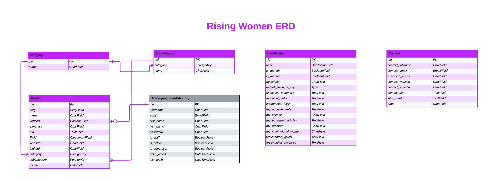
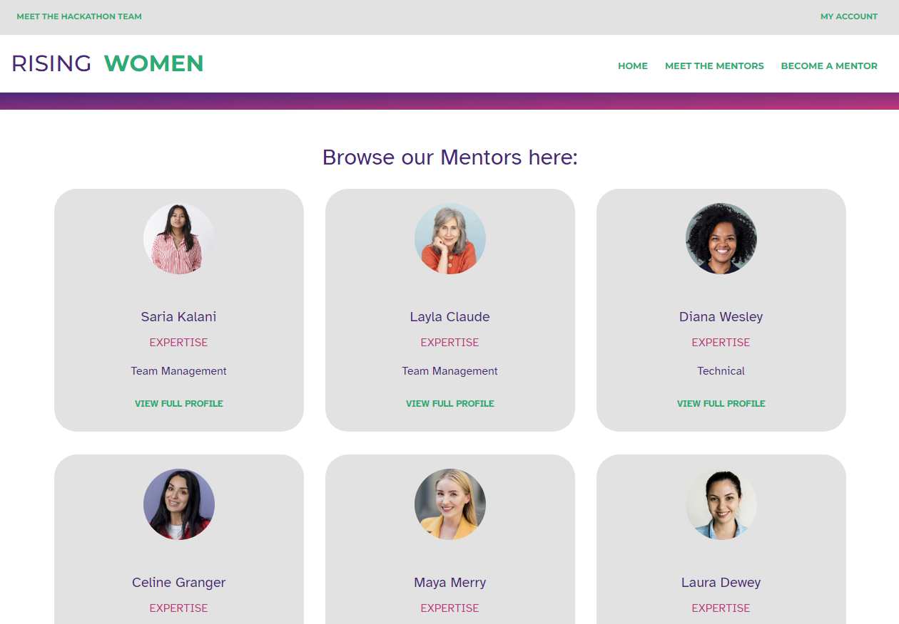
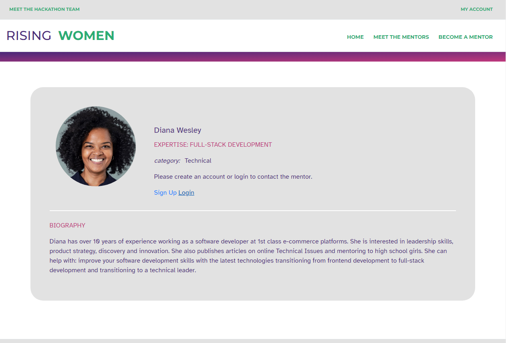
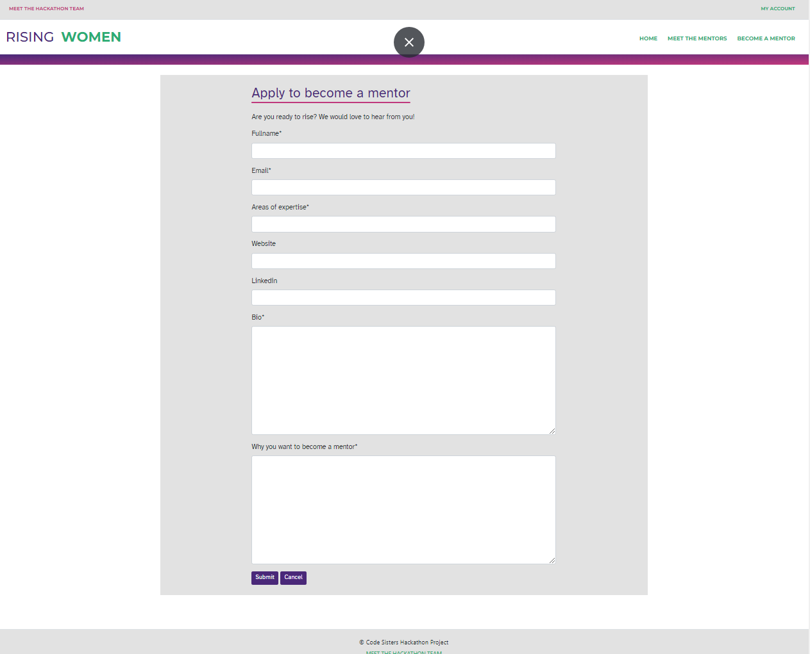

# **RISING WOMEN**

**[Link to the deployed site](https://rising-women.herokuapp.com/)**

# Project Overview
Rising Women is a platform developed by women for women in technology to help mitigate the lack of representation in technical roles, particularly in leadership positions by:
* promoting awareness of leading women in technology by enabling users to curate a list of successful, inspiring role models
* enabling women leaders in the technology sector to mentor and support other women through insights-, skills- and strategies-sharing
* providing opportunities for women technologists to learn from, be inspired by and network with other women and women role models in the field

This platform was built using Django, Python, JavaScript and Bootstrap 4. The site was deployed on Heroku and uses Cloudinary for cloud storage.

Rising Women is Team 6: Code Sisters' project submission for Code Institute's Women in Technology Hackathon, March 2023.

---
**TABLE OF CONTENTS**
* [USER EXPERIENCE](#user-experience)
    * [Strategy Plane](#strategy-plane)
        * [Project Goals](#project-goals)
            * [Problems We Are Trying to Solve](#problems-we-are-trying-to-solve)
            * [Platform Goals](#platform-goals)
    * [Scope Plane](#scope-plane)
        * [Feature Planning](#feature-planning)
    * [Structure Plane](#structure-plane)
        * [Interaction Design](#interaction-design)
            * [User Flow Diagram](#user-flow-diagram)
        * [Information Architecture](#information-architecture)
            * [Site Map](#site-map)
        * [Database Design](#database-design)
            * [Database ERD](#database-erd)
            * [Data Modelling](#data-modelling)
                * [User Model](#user-model)
                * [UserProfile](#userprofile-model)
                * [Category Model](#category-model)
                * [Subcategory Model](#subcategory-model)
                * [Mentor Model](#product-model)
                * [Bookmark Model](#order-model)
        * [User Stories](#user-stories)
    * [Skeleton Plane](#skeleton-plane)
        * [Wireframes](#wireframes)
    * [Surface Plane](#surface-plane)
        * [Typography](#typography)
        * [Colour Palette](#colour-palette)
        * [Imagery](#imagery)
* [Agile Methodology](#agile-methodology)
    * [GitHub Projects](#github-projects)
* [Features](#features)
    * [Mentor Expertise Categorization](#mentor-expertise-categorization)
    * [Defensive Programming](#defensive-programming)
    * [Accessibility](#accessibility)
    * [Extra Meta Tags for Specific Pages](#extra-meta-tags-for-specific-pages)
    * [Mentor Management - Authorized Personnel Only](#product-management---authorized-personnel-only)
    * [Bookmark](#bookmark)
    * [Site Features Common to All Pages](#site-features-common-to-all-pages)
    * [Site Pages](#site-pages)
* [Future Development, Iteration and Implementation](#future-development-iteration-and-implementation)
* [Technologies Used](#technologies-used)
    * [Languages Used](#languages-used)
    * [Frameworks Used](#frameworks-used)
    * [Databases Used](#databases-used)
    * [Libraries and Packages Used](#libraries-and-packages-used)
    * [Programmes and Applications Used](#programmes-and-applications-used)
    * [Cloud Application Platforms Used](#cloud-platforms-used)
    * [Cloud Storage Services Used](#cloud-storage-services-used)
* [Testing](#testing)
* [Bugs, Issues and Solutions](#bugs-issues-and-solutions)
* [Deployment and Local Development](#deployment-and-local-development)
    * [Deployment](#deployment)
    * [Local Development](#local-development)
        * [How to Fork](#how-to-fork)
        * [How to Clone](#how-to-clone)
* [Credits](#credits)
* [Acknowledgements](#acknowledgements)
---

# USER EXPERIENCE
## Strategy Plane
Numerous case studies, research reports and white papers point to and acknowledge that Women in technology are still woefully underrepresented, particularly in leadership positions. This can, unfortunately, create a culture where women feel isolated and excluded, and may not have role models or mentors to support their career development.

A [PwC UK research report, Women in Tech - Time to close the gender gap, 2017](https://www.pwc.co.uk/women-in-technology/women-in-tech-report.pdf) pointed out that: *Despite decades of progress towards workplace equality, women remain woefully underrepresented in the UK’s technology workforce.* According to the report,
* just **23%** of the people working in STEM (Science, Technology Engineering and Mathematics) roles across the UK are female
* only **5%** of leadership positions in the technology industry are held by women

According to [Anita Borg Institute's Advancing Women Technologists into Positions of Leadership report, 2020](https://anitab.org/wp-content/uploads/2020/08/advancing-women-technologists-leaders.pdf), *The lack of advancement of women technologists is staggering. At current advancement rates, it will take **100 years** for women in technical and non-technical roles combined to reach parity with men at the C-level.*

### Project Goals
This section aims to answer the key question: *What problems are we trying to solve?*

The Rising Women project is focused on tackling the challenges around the Hackathon Topic 2: **Lack of representation: Women are often underrepresented in technical roles, particularly in leadership positions. This can create a culture where women feel isolated and excluded, and may not have role models or mentors to support their career development.**

#### Problems We Are Trying to Solve
* Problem 1: Women technologists may not have access to mentors to support their career

To help women reach their full potential in the industry, we believe that it is imperative that opportunities from mentorship initiatives are made easily accessible. These mentorship initiatives are aimed at supporting women to achieve their short-term and mid-term careers goals as well as advance to more senior positions.

* Problem 2: Women technologists may not have other women role models to be inspired by

One of the calls to action from PwC's report stated that: *You can’t be what you can’t see: The importance of visible role models at all levels.*

We aim build a list of women in the industry role models at all levels and *shout louder about the role models already working in tech...so that they become more visible* to everyone of us in the field.

* Problem 3: Women technologists may feel isolated and excluded in a male-dominated industry

We aim to help combat the feeling of being isolated and excluded by creating opportunities for networking, being mentored and potentially also mentoring other women who are a level or two below them in terms of experience and seniority.

* Platform Goals
1. Grow list of volunteer women in tech mentors
2. Publicly recognize/ promote inspiring women in tech from all levels
3. Provide a safe, easy to use platform for networking with other women in the field

## Scope Plane

**Feature Planning**
When planning the Rising Women's features and scope, we drew up a Desirability, Importance and Viability analysis of all the features to be included in the project, and ranked each of these by order of importance from low (1) to high (5). The features that ranked the highest will be prioritised and delivered as part of the MVP. The target users for each ranked feature were also included.

| # | Feature | Target User | Desirability | Importance | Viability  | Delivered |
| --- | --- | --- | --- | --- | --- | --- |
| User Accounts |  |  |  |  |  |  |
| 1 | User Role Permissions | All Users 1 | 5 | 5 | 5 | ✅ |
| 2 | Account Registration | All Users 1 | 5 | 5 | 5 | ✅ |
| 3 | User Email Confirmation | All Users 1 | 5 | 5 | 5 | ✅ |
| 4 | Password Reset | All Users 1 | 5 | 5 | 5 | ✅ |
| 5 | Social Media Registration &amp; Login | All Visitors | 5 | 2 | 2 | ❌ |
| 6 | User Profile Page | Registered Users | 5 | 5 | 5 | ✅ |
| Navigation |  |  |  |  |  |  |
| 7 | Top Navigation to include: logo, search bar, my account (register, login) | All Users 1 | 5 | 5 | 5 | ✅ |
| 8 | Top Navigation to include: my account (my profile, logout), bookmark | Logged In Users | 5 | 5 | 5 | ✅ |
| 9 | Top Navigation Search Bar: to be enabled for mentor name, description and category search | All Users 1 | 5 | 5 | 5 | ✅ |
| 10 | Top Navigation to include: my account (my profile, logout) and bookmark | Logged In Superadmins | 5 | 5 | 5 | ✅ |
| 11 | Main Navigation to include links to: mentors, inspirational women in tech, about us | All Users 1 | 5 | 5 | 5 | ✅ |
| Mentors |  |  |  |  |  |  |
| 12 | List of Mentors | All Users 1 | 5 | 5 | 5 | ✅ |
| 13 | Mentor Categories (Expertise) | All Users 1 | 5 | 5 | 5 | ✅ |
| 14 | Mentor Detail page | All Users 1 | 5 | 5 | 5 | ✅ |
| Profiles |  |  |  |  |  |  |
| 15 |  User Profile page |  All Users 1 | 5 | 5 | 5 | ✅ |
| 16 | Registered Users Curate Their Own Content All Users 1 | 5 | 5 | 5 | ✅ |
| 17 | Registered Users Update Their Own Content All Users 1 | 5 | 5 | 5 | ✅ |
| Bookmark |  |  |  |  |  |  |
| 18 | Individual User's Bookmark - Create, Read, Update and Delete Bookmark | Logged In Users | 5 | 5 | 5 | ✅ |
| Digital Marketing |  |  |  |  |  |  |
| 19 | Social Media Presence | Superadmins | 5 | 5 | 5 | ✅ |
| Email Marketing |  |  |  |  |  |  |
| 20 | Email Subscription, Powered by MailChimp | Registered Subscribers | 3 | 3 | 3 | ❌ |
| Contact Us |  |  |  |  |  |  |
| 21 | Contact Form | All Users 1 | 3 | 3 | 3 | ❌ |

1. All Users: Site Visitors, Logged In Users, Superadmins

## Structure Plane
### Interaction Design

* User Flow Diagram 

### Database Design
* Database

**Entity Relationship Diagram**
* [ERD Version 1](./documentation/rising-women-erd-v1.png)
* [ERD Version2](./documentation/rising-women-erd-v2.png)
* ERD Version 3 - FINAL 

This ER diagram captures the relationships between real-world entities. The entities are the data points of objects such as persons, places and things and together with their attributes, compose their domain, ie, their individual table. The cardinality (relationships) between these entities are then mapped and identified.

* Data Modelling
    As evidenced by the ERD discussed above, the data model type used for this project is the Relational Model.
    * **User Model**
    - The User model is a component of Django's Authentication system and contains information about the user.
    - The User model contains the following fields: username, email, first_name, last_name, password, is_staff, is_active, is_superuser, date_joined, and last_login.

    * **UserProfile Model**
        - The UserProfile model is an extension of the Django User model and has a one-to-one relationship with it.
        - The UserProfile model contains the following fields: user, is_mentor, is_mentee, default_town_or_city, executive_summary, technical_skills, leadership_skills, my_achievements, my_linkedin, my_website, my_pyblished_articles, my_mentors, my_inspirational_wwomen, my_testimonials_given, my_testimonials_received
        - The UserProfile model is included in the installed profiles application.

    * **Category Model**
        - The Category model contains the following fields: name.
        - It is one of the models included in the installed mentors application.

    * **Subcategory Model**
        - The Subcategory model contains the following fields: name, category.
        - It contains the Category model as a foreignkey.
        - It is one of the models included in the installed mentors application.

    * **Mentor Model**
        - The Mentor model contains the following fields: name, slug, verified, expertise, bio, image, website, linkedin, category, subcategory.
        - It contains the Category model as a foreignkey.
        - It contains the Subcategory model as a foreignkey.
        - It is one of the models included in the installed mentors application.

    * Contact Model
        - The Cintact model contains the following fields: fullname, email, verified, areas_of_expertise, website, linkedin, bio, why_you_want_to_become_a_mentor
        - It is the only model included in the installed contact application.

### User Stories
| #                                | Issue ID | Target User | User Story                                                                                                                                                                                                 |
|----------------------------------| --- |-------------|------------------------------------------------------------------------------------------------------------------------------------------------------------------------------------------------------------|
| VIEWING &amp; NAVIGATION         |  |             |                                                                                                                                                                                                            |
| 1                                | [add-here-issue-number](add-here-issue-closed-resolved-number) | Visitor     | I want to be able to navigate around the site to view a list of mentors                                                                                                                                    |
| 2                                | [add-here-issue-number](add-here-issue-closed-resolved-number) | Visitor     | I want to be able to navigate around the site to view a list of inspiring women in technology                                                                                                              |
| 3                                | [add-here-issue-number](add-here-issue-closed-resolved-number) | Visitor     | I want to be able to navigate around the site to learn more about Rising Women and the team behind the site                                                                                                |
| 4                                | [add-here-issue-number](add-here-issue-closed-resolved-number) | Visitor     | I can click on Register button on Home Page so that I can navigate to Registration Page.                                                                                                                   |
| 5                                | [add-here-issue-number](add-here-issue-closed-resolved-number) | Visitor     | in the Registration Page I can fill a form with my name, my surname, my e-mail address, my phone number so that I can create an account as a mentee.                                                       |
| 6                                | [add-here-issue-number](add-here-issue-closed-resolved-number) | User        | I can reach the mentors on Linked in and Github after registration so that I can have communication ways with mentors.                                                                                     |
| 7                                | [add-here-issue-number](add-here-issue-closed-resolved-number) | User        | I can visit mentor profiles by clicking on their name from the search results so that I can reach information like current job title, linked in and github accounts, image and availability about mentors. |
| REGISTRATION &amp; USER ACCOUNTS |  |             |                                                                                                                                                                                                            |
| 8                                | [add-here-issue-number](add-here-issue-closed-resolved-number) | User        | Easily register for an account and be able to view my profile                                                                                                                                              |
| 9                                | [add-here-issue-number](add-here-issue-closed-resolved-number) | Visitor     | I can click on Register button on Home Page so that I can navigate to Registration Page.                                                                                                        |
| 10                               | [add-here-issue-number](add-here-issue-closed-resolved-number) | Visitor     | In the Registration Page I can fill a form with my name, my surname, my e-mail address, my phone number so that I can create an account as a mentee.                                                       |
| SORTING &amp; SEARCHING          |  |             |                                                                                                                                                                                                            |
| 11                               | [add-here-issue-number](add-here-issue-closed-resolved-number) | Visitor     | I can have access to Career Couching by filtering skills that I need to on Search Page, so that I can find the right mentor for me.                                                             |
| USER'S BOOKMARKS                 |  |             |                                                                                                                                                                                                            |

## Skeleton Plane
* Wireframes

* Initial Design
[initial design spec](./documentation/rising_women_design_spec.pdf)

## Surface Plane
* Typography
Monserrat was selected for headings, and Atkinson Hyperlegible for body text (highly legible)
* Colour Palette

* Imagery
The main image, and the headshots of Mentors are from www.freepix.com, and are used for eductional purposes only
# Agile Methodology
## **GitHub Projects**
GitHub Projects was used to manage the development of the site. It helped our team to break down large issues into smaller issues and how these fit into the overall goals of implementing specific features we wanted for the site. We also used labels to distinguish the issues which are part of the setup, of the documentation, the must haves and the enhancements, and the required validations.

# Features
* Mentor Expertise Categorization
* Defensive Programming
* Accessibility
* Extra Meta Tags for Specific Pages
* Mentor Management - Authorized Personnel Only
* Bookmark
* Site Features Common to All Pages
* Site Pages
# Future Development, Iteration and Implementation
# Technologies Used
## Languages Used
* [HTML5](https://en.wikipedia.org/wiki/HTML5) was used for the content and structure of the site.
* [CSS3](https://en.wikipedia.org/wiki/CSS#CSS_3) was used for the styling of the site.
* [JavaScript](https://en.wikipedia.org/wiki/JavaScript) was used for the interactivity of the site.
* [Python](https://www.python.org/) was used for the back end programming of the site.
## Frameworks Used
* [DJANGO - v3.2 ](https://docs.djangoproject.com/en/4.1/releases/3.2/) Django is a free and open-source, Python-based web  framework that follows the model–template–views architectural pattern.
* [Bootstrap4 - v4.6](https://getbootstrap.com/docs/4.6/getting-started/introduction/) was used as the frontend framework.
## Databases Used
* [DB.SQLITE3](https://docs.djangoproject.com/en/4.1/ref/databases/#sqlite-notes) was the database used for the project (development).
* [ElephantSQL](https://www.elephantsql.com/) ElephantSQL's Postgres as a Service was used to host the the database for the project (production).
## Libraries and Packages Used
* [django-allauth](https://django-allauth.readthedocs.io/en/latest/) is an integrated set of Django applications dealing with account authentication, registration, management, and third-party (social) account authentication.
* [JQuery - v3.5.1](https://jquery.com/) is a fast, small, and feature-rich JavaScript library.
* [Font Awesome Kit](https://fontawesome.com/v5/docs/web/setup/use-kit) is used for its icon toolkit.
* [django-crispy-forms, v1.14.0](https://pypi.org/project/django-crispy-forms/) was used to build programmatic reusable layouts out of form components.
* [gunicorn](https://gunicorn.org/) - a Python WSGI HTTP Server that allows us to run any Python application concurrently by running multiple processes within a single dyno
* [pillow](https://pypi.org/project/Pillow/) - a required Python imaging library used to enable handling of images.
* [psycopg2](https://pypi.org/project/psycopg2/) - a postgresql database adapter for python and used to connect with our postgres database
* [django storages](https://django-storages.readthedocs.io/en/latest/) - collection of custom storage backends for Django

## Programmes and Applications
* [Lucid Chart](https://www.lucidchart.com/pages/) was used to draw and build the Entity Relationship Diagram. It was also used to draw the User Flow Diagram.
* [favicon.io](https://favicon.io/) used to create the site's favicon
* [Git](https://git-scm.com/) used for version control and saving work in the repository, using the GitPod extension in Google Chrome to commit to GitHub.
* [GitHub](https://github.com/) is the project's git repository
* [GitHub Projects](https://docs.github.com/en/issues/planning-and-tracking-with-projects/learning-about-projects/about-projects) used to track and integrate issues for Agile Development
* [Chrome DevTools](https://www.google.com/intl/en_uk/chrome/) - used for debugging, validation (Lighthouse) and taking fullscreen screenshots of the site
## Cloud Application Platforms Used
* [Heroku](https://devcenter.heroku.com/) was used for hosting and deployment of the live site. Throughout, we have ensured the version being deployed to Heroku matches the development version by checking features and screen layouts on both versions.
## Cloud Storage Services Used
* [Cloudinary](https://cloudinary.com/developers) was used to store the images.
# Testing
Please refer to [TESTING.md](./TESTING.md) file for:
* Automated Testing and Validation Results
* Manual Testing and Results
## Bugs, Issues and Solutions
Please also refer to [TESTING.md](./TESTING.md) file for:
* Solutions to bugs found during testing and development phase
* Known bugs
# Deployment and Local Development
## Deployment
Please refer to [DEPLOYMENT.md](./DEPLOYMENT.md) file for the steps to:

* Creating the database to be used in production
* Deploying to Heroku
* Setting up Cloudinary for hosting media files

### Local Development
Please refer to [DEPLOYMENT.md](./DEPLOYMENT.md) file for steps to:
* How to Fork
* How to Clone

# Credits

Code Institute's Boutique Ado walkthrough.
https://github.com/JoyZadan/shop-kbeauty

# Acknowledgements
